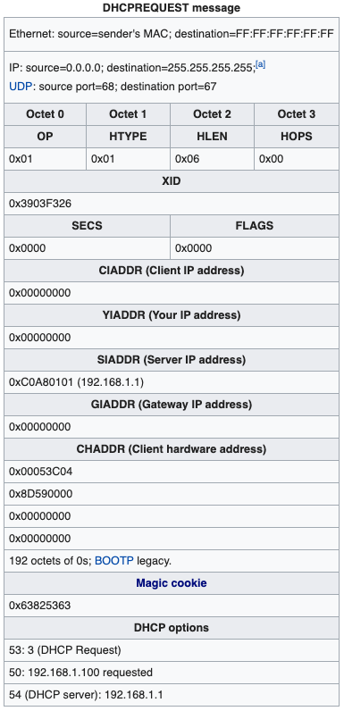
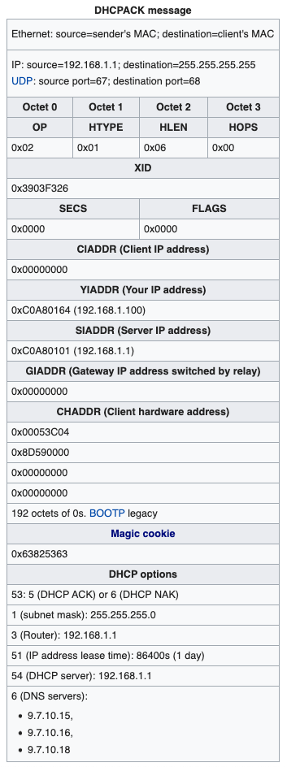

# Golang DHCP Client Demonstration

A toy golang DHCP client to explore the DHCP protocol.
Randomizes request MAC address as to not step on the same lease over and over.

## Usage
```bash
./compile.sh
./toydhcp [-ip4 address]
```

## DHCP Protocol Diagram

  
Wikipedia - Gelmo96 / CC BY-SA (https://creativecommons.org/licenses/by-sa/4.0)

## DHCP Packets (DORA)

#### DISCOVER


#### OFFER


#### REQUEST


#### (N)ACKNOWLEDGE


## DHCP Option Codes
A small selection of important DHCP Option Codes
- *53* - DHCP Message Type (1B) - Indicates the specific type of DHCP message: DISCOVER(1), OFFER(2), REQUEST(3), DECLINE(4), ACK(5), NACK(6), RELEASE(7), INFORM(8)
- *50* - Requested IP Address (4B)
- *54* - DHCP Server Address (4B)
- *51* - Lease Time in Seconds (4B)
- *3* - Router IP Address (4B)
- *1* - Network Subnet Mask (4B)
- *255* - End Mark (1B)

## Additional Reading
[Wikipedia.org - DHCP](https://en.wikipedia.org/wiki/Dynamic_Host_Configuration_Protocol)   
[The TCP/IP Guide - DHCP Options](http://www.tcpipguide.com/free/t_SummaryOfDHCPOptionsBOOTPVendorInformationFields-2.htm)